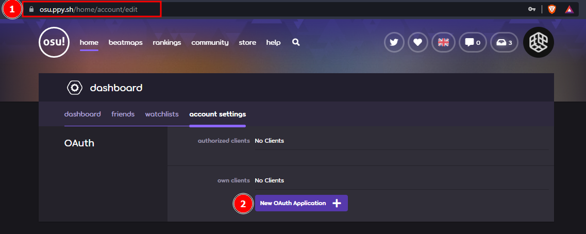
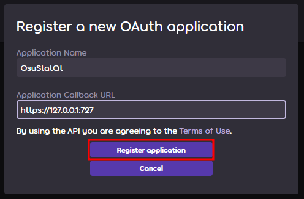
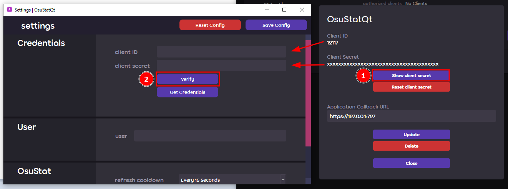
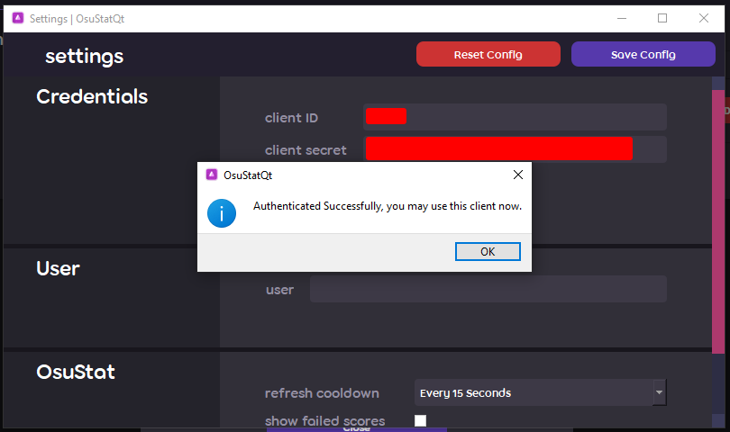

<!-- Logo -->

<p align="center">
  
</p>

# Osu!StatQt

Osu statistics right on your desktop, made with Qt5

A lightweight desktop application to show you information about plays, scores and beatmaps. Basically a simplified osu-web client.

## Status

Currently, it is a passion project for me and I'm creating this to learn the pyQt framework and more stuff about Python. I plan on adding features to it with time and frequent releases as well until its fully complete or there are changes in osu API V2.

In its alpha stage, this is just the barebones with basic features. With the subsequent beta and stable releases, the featureset would only increase.

## Usage

As of the current release, you can [set a default user](#setting-default-user) for osu stat and view your recent activity and scores (including failed scores) as well as their information such as Performance Points, Time, Beatmap Title, Diff and Ranked Score.

## Installing Osu!StatQt

Binaries are only available for windows as of now, but you can always run the python script from the source files on any operating system with python and its dependencies installed.

**Latest Release:**

| [Windows 8.1+ (x64)](https://github.com/sortedcord/osu-statqt/releases) | 
| ------------- |

## Configuring Osu!StatQt

<i>Note: Osu!StatQt generates a config file. Do not edit it manually by opening it in any text editor nor share it to anyone else!</i>

### Api Credentials

OsuStat uses Circleguard's [ossapiV2](https://github.com/circleguard/ossapi) which is a python wrapper for Osu-api V2. This requires you to create a OAuth Application in your [osu account settings](https://osu.ppy.sh/home/account/edit)

<summary>
<details>
Open OsuStatQt and go to <b> Preferences > Settings </b> and then click on `Get Credentials` Button.


You would have to login in case you are not already logged in then go to the account setting page. There you would need to scroll all the way down to the OAuth Section and click on new OAuth Application.



In the popup, set the application name as anything you want and for the redirect url, set it as `https://127.0.0.1:727`.




<i>You may need to change `727` to something else if you already have some process using that port.</i>

Entering the details will give you <b>Client ID</b> and <b>Client Secret</b>. Copy them to the OsuStatQt settings page (Make sure there are no spaces in either of the fields) and click `Verify`.



If you entered the credentials properly, then you will get a message telling you so. 



</details>
</summary>
<br>
Once this is done, you can move on to setting up Default user and start using OsuStatQt.
<br>

### Setting Default User

In order to set a default user (which generally is you but it can be any user on Bancho), open settings and enter the default username in the user field. You have to enter the correct spelling else it may set it as somebody else or may not find the user at all!

## Building Osu!StatQt

I use `pyinstaller` for building and managing packages for OsuStatQt. It is highly recommended to use a virtual environment when building with pyinstaller.

[Circleguard's ossapi](https://github.com/circleguard/ossapi) causes issues with pyinstaller as for some reason its not able to read the dumped token files. Instead I suggest using https://github.com/sortedcord/ossapi which I have modified to not dump the tokens at all.


``` bash
# Assuming this is in a venv

git clone https://github.com/sortedcord/ossapi
cd ossapi
pip install -e .
```

Other dependencies which you will need include the following.

``` bash
pip install -r requirements.txt
```

``` bash
# In a separate folder

git clone https://github.com/sortedcord/osu-statqt.git
cd osu-statqt
```

Build files are included with in the source code. Use [onefile.spec](onefile.spec) to build a single file binary and use [build_package.spec](build_package.spec).

### Enable verbose (console)

Change `console=False` to `console=True` in `.spec` files.

### Mac OS (Catalina and above)

I don't own a Mac nor am I interested in setting up a hackintosh, so practically there is no way for me to test the mac os build, however the process of building binaries is more or less the same, the only catch is to build a standalone binary.

```bash
pyinstaller onefile.spec
```

## Credits

Would like to thank these creators for their projects and contributions.

- [ppy, osu-web API & osu-resources](https://github.com/peppy)
- [circleguard: osuAPI, licensed under GPL-3.0 License](https://github.com/circleguard/ossapi)
